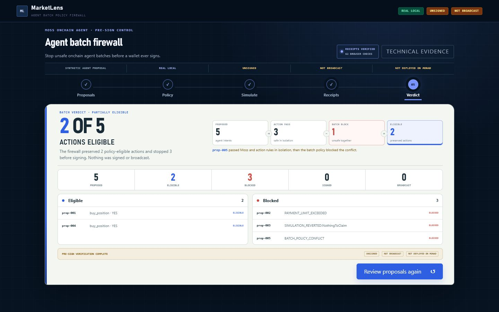
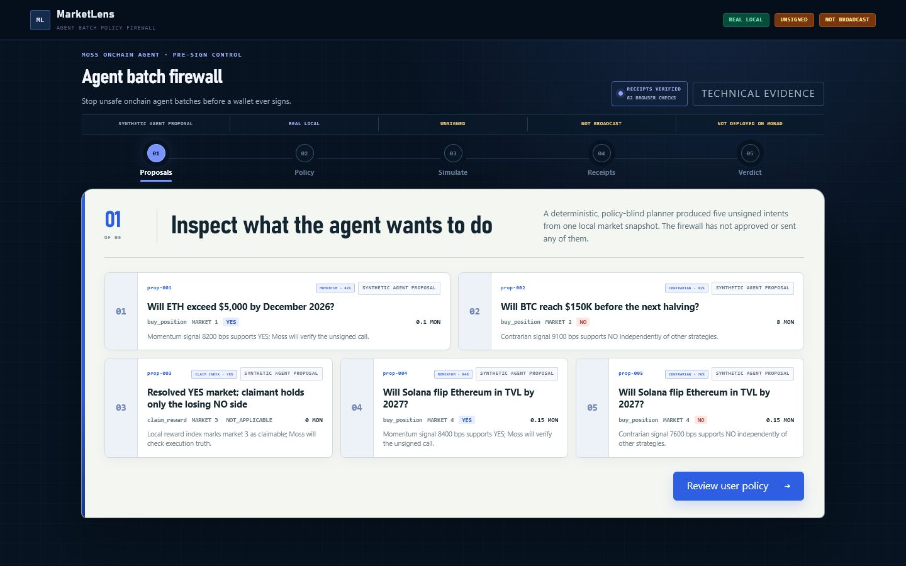
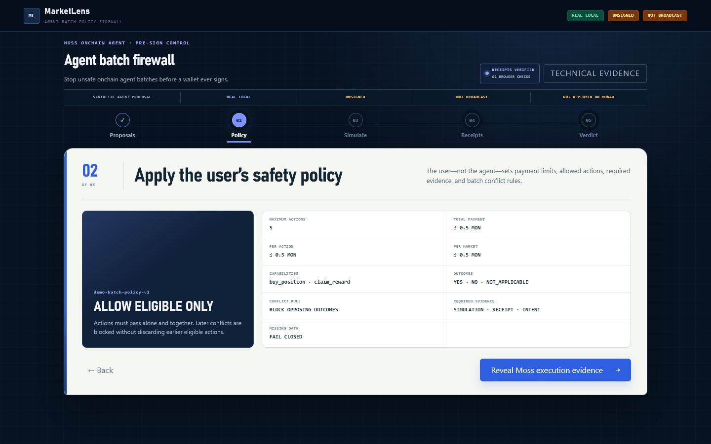
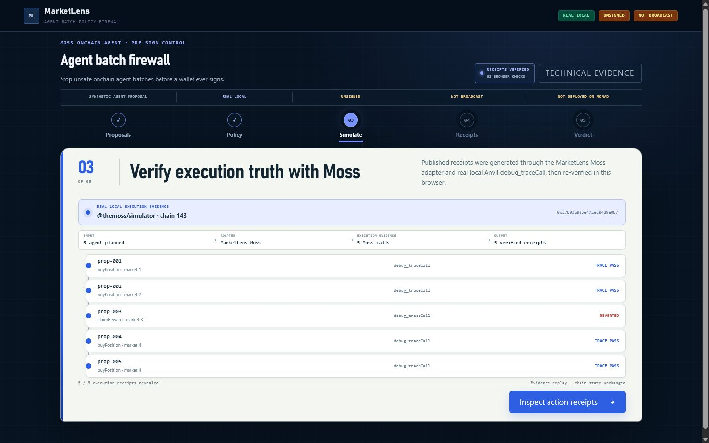

# MarketLens

MarketLens is a pre-sign policy firewall for AI-agent-prepared prediction-market actions.

The current demo uses deterministic synthetic Agent proposals and pre-generated local Moss simulation evidence.



## Problem

AI Agents can prepare transaction actions faster than users can manually inspect them. MarketLens inserts a deterministic policy and evidence-verification layer before signing.

## How it works

```
Synthetic Agent Batch
  → User Policy
  → Moss Evidence Verification
  → Structured Receipts
  → Batch Verdict
  → Unsigned Allowlist
```

The browser demo consumes pre-generated local Moss simulation outputs. It does **not** trigger a new live Anvil simulation on demand, and it does **not** connect to Monad.

## Policy presets

| Policy | Eligible | Blocked | Main behavior |
| --- | --- | --- | --- |
| Strict | 1 | 4 | Low action (0.10 MON) and batch (0.25 MON) limits; conflicts blocked |
| Default | 2 | 3 | Moderate limits (0.50 MON); conflicts blocked |
| Permissive | 4 | 1 | High limits (10.00 MON); opposing positions allowed |

The verified fixture produces: 5 proposed, 2 eligible, 3 blocked, 0 signed, 0 broadcast (Default policy).

## 30-second judge path

```bash
pnpm install --frozen-lockfile
pnpm --filter @marketlens/web dev --port 3300
```

Open <http://localhost:3300> to see the five-step batch policy firewall demo. The `predev` script automatically builds all workspace dependencies (`@themoss/core` → `@themoss/simulator` → `@marketlens/moss-prediction-market` → prediction-market-actions → agent-planner → batch-policy) before starting Next.js.

## Verified in this submission build

| Check | Result |
| --- | --- |
| Foundry | 44 passed, 0 failed (from prior reproducible audit) |
| Batch-policy Vitest | 10 passed, 0 failed, 12 skipped |
| Live-Anvil integration tests | 12 skipped (requires local Anvil; skip in offline CI) |
| Typecheck | 0 errors |
| Lint | 0 errors, 2 warnings |
| Next.js build | 10 routes total (9 static + 1 dynamic API) |
| Analytics pytest | not independently revalidated in this submission build |

Full Next.js route table from build output:

```
○  /                          static
○  /_not-found                static
○  /action                    static
○  /analytics                 static
ƒ  /api/evaluate-batch        dynamic
○  /architecture              static
○  /demo                      static
○  /icon.svg                  static
○  /product-analytics         static
○  /verification              static
```

## Current status

| Capability | Status | Boundary |
| --- | --- | --- |
| Solidity prediction market | **REAL LOCAL** | Foundry contract and tests |
| Event indexing and analytics | **PARTIALLY VERIFIED** | Local pipeline implemented; current submission tests not revalidated |
| Moss protocol adapter | **REAL LOCAL** | Source-pinned `@themoss/core` integration |
| Moss Evidence Verification | **REAL LOCAL** | Unsigned local Anvil `debug_traceCall`; pre-generated outputs |
| Batch policy firewall | **REAL LOCAL** | Action and batch policy verdicts |
| Web workflow | **REAL UI** | Consumes pre-generated local simulation artifacts |
| Wallet signing | **NOT IMPLEMENTED** | No signer or private-key path |
| Broadcasting | **NOT IMPLEMENTED** | No send path |
| Monad deployment | **NOT DEPLOYED** | Local evidence only |

## Repository layout

```text
marketlens/
├── contracts/                         # Solidity contract and Foundry tests
├── analytics/                         # RPC indexer, SQLite, SQL/pandas analytics
├── external/moss/                     # Vendored Moss @themoss/core and @themoss/simulator
├── packages/
│   ├── prediction-market-actions/     # Action calldata and application seam
│   ├── moss-prediction-market/        # Source-pinned Moss protocol adapter
│   ├── batch-policy/                  # Phase 4A action/batch policy firewall
│   ├── agent-planner/                 # Deterministic Agent proposal generator
│   └── polymarket-shadow/             # Shadow-market research implementation
├── web/                               # Next.js evidence and firewall UI
├── config/                            # Network and deployment manifests
├── artifacts/                         # ABI, reproduction, and visual evidence
├── scripts/                           # Local bootstrap/reproduction entrypoints
└── docs/                              # Architecture, audits, and phase reports
```

## Install

```powershell
# Requirements: Node >= 22, pnpm 11.10.0 (via corepack)
pnpm install --frozen-lockfile
```

This resolves all workspace packages including the vendored `@themoss/core` and `@themoss/simulator` under `external/moss/`. No git submodule or external clone step is required.

Analytics uses Python 3.11 and `uv`; contracts use Foundry in WSL.

## Moss dependency provenance

MarketLens vendors `@themoss/core` and `@themoss/simulator` from the Moss upstream repository.

- **Upstream:** <https://github.com/nishuzumi/moss>
- **Pinned commit:** `d09b38cbc44ee7f5722c5d09e7224f7750187762` (2026-07-22)
- **License:** MIT
- **Included:** `packages/core/`, `packages/simulator/`
- **Vendored under:** `external/moss/`
- **Modifications:** None — vendored as-is from the pinned upstream commit

See `external/moss/UPSTREAM.md` for the full provenance record.

## Verify Phase 4A

```powershell
pnpm verify:phase4a
```

This regenerates Batch artifacts from a no-key local Anvil fixture, verifies 99 release-time and 60 browser-time integrity conditions, runs Batch Policy and tamper tests, typechecks and lints the workspace, and builds the Next.js application.

Focused commands:

```powershell
pnpm --filter @marketlens/batch-policy test
pnpm --filter @marketlens/batch-policy generate
pnpm --filter @marketlens/batch-policy verify:artifacts
```

## Full local verification

```powershell
pnpm verify:phase4a:full
```

The full command installs the locked JavaScript dependencies, runs the focused Phase 4A verification plus Analytics, Action, Moss core/simulator/protocol, shadow-market, Foundry unit/fuzz/invariant, format, secret, and Git whitespace checks. Its protocol fixture starts a no-key local Anvil on port `8546` and always stops it, including after a failed check.

## Demo walkthrough


*Step 1 — Five synthetic Agent proposals arrive. The Agent proposes; it does not approve or send.*


*Step 2 — User policy controls: three presets (Strict/Default/Permissive) with configurable payment limits and conflict rules.*


*Step 3 — Pre-generated Moss evidence is revealed and re-verified in the browser (60 Web Crypto integrity checks).*


*Steps 4–5 — Action Receipts and Batch Verdict: 2 eligible, 3 blocked under Default policy. Zero signed, zero broadcast.*

## Safety boundaries

- `SYNTHETIC AGENT PROPOSAL`
- `REAL LOCAL`
- `UNSIGNED`
- `NOT BROADCAST`
- `NOT DEPLOYED ON MONAD`

No UI control or backend path signs, submits, executes, or broadcasts the Agent proposals.
